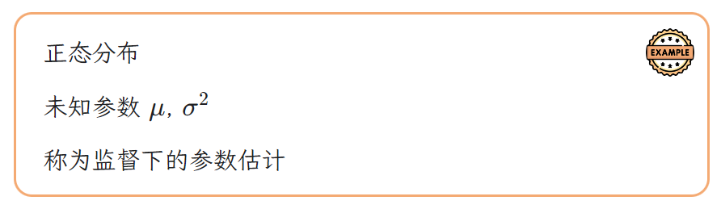
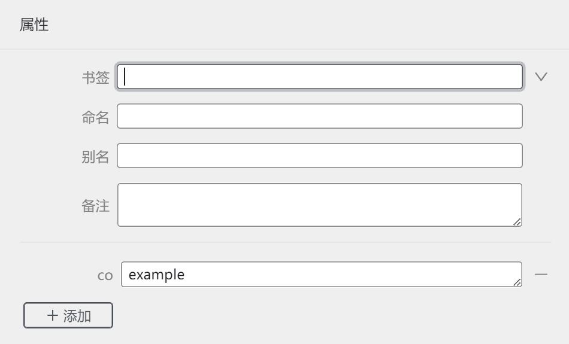
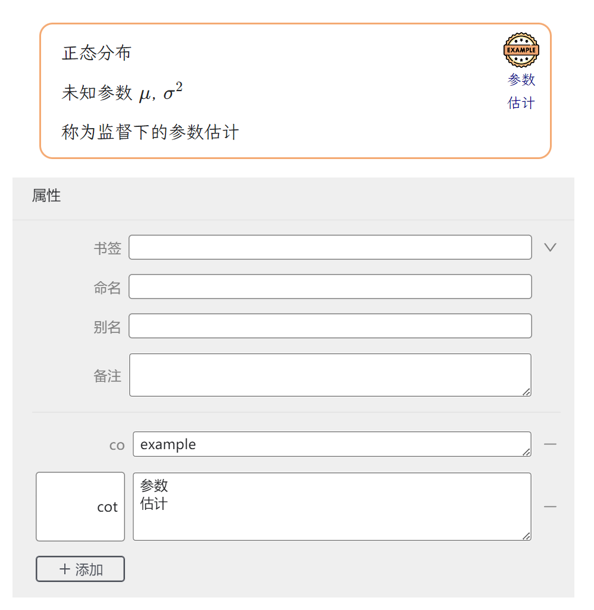
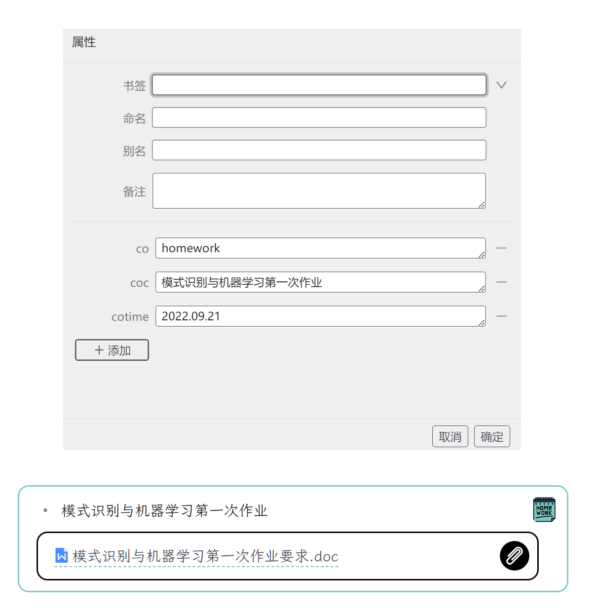
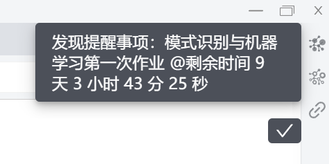
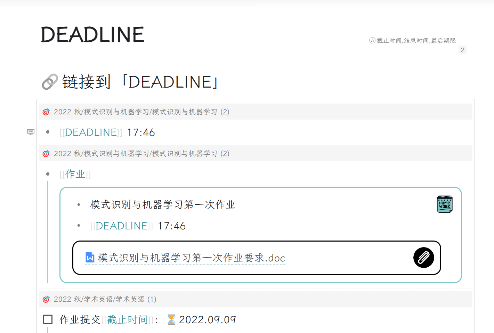
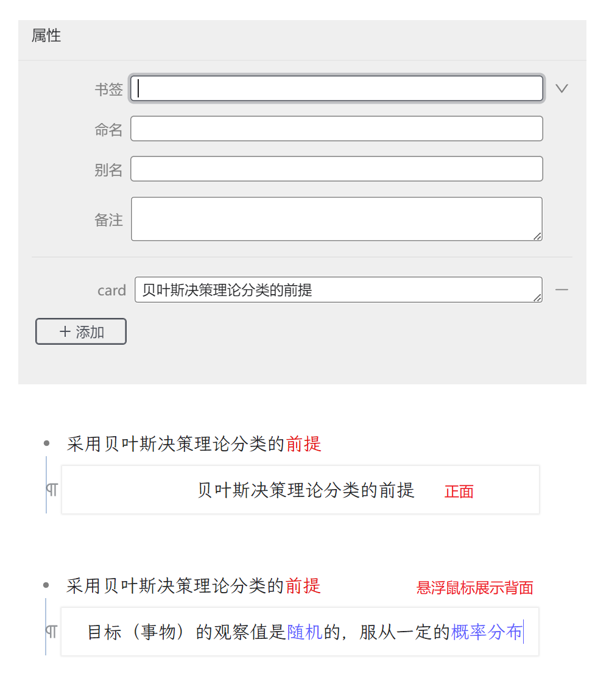
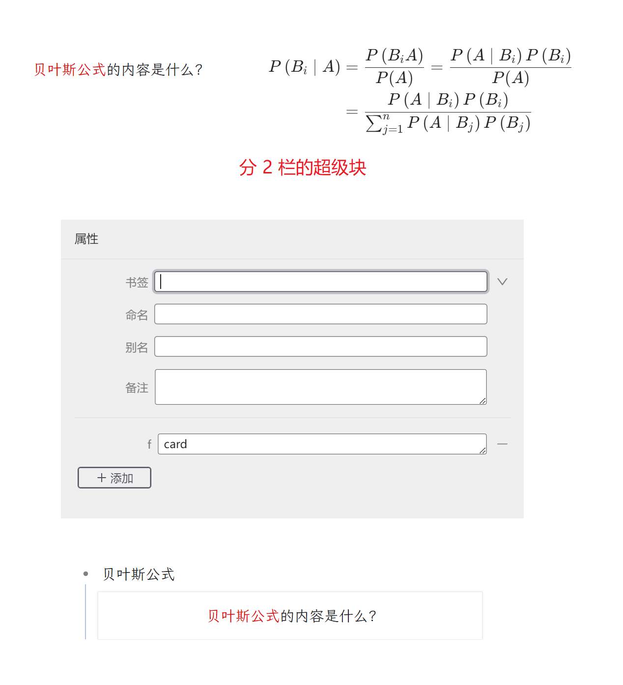

# RogerSyTheme

参考 [Chrome-A4](https://github.com/UserZYF/Chrome-A4) 和 [zhang-light](https://github.com/UserZYF/zhang-light) 修改而来的思源笔记主题。

# 功能

## 自定义属性

- 继承了 [zhang-light](https://github.com/UserZYF/zhang-light) 的所有自定义属性。

# 特色功能

## 快捷键

|按键|功能|
|:-:|-|
|ctrl+F1|隐藏边栏和标题|
|ctrl+F2|通知页面事项|
|ctrl+F3|展示 SQL 嵌入块的 hpath|
|ctrl+F5|强制重新加载|

## callout 功能

### `co` 属性

针对引述块的 callout 样式

内置了 100 多个 callout 类型，只需要在引述块自定义 `co` 属性即可。

其他 callout 名称参考 `style/callout` 文件夹内图片名称，当然也可以自定义替换。

### `cot` 属性

在设置了正确的 `co` 属性之后，继续设置 `cot` 属性，就可以提供 callout 图片下方的提示文字。

### `coc` 属性

由于在`通知页面事项`功能中提供额外信息。

### `cotime` 属性

由于在`通知页面事项`功能中提供时间检查。

## 通知页面事项

当页面中存在属性值为 `"notice", "todo", "plan", "wait", "homework"` 的 callout 块时，使用快捷键 `ctrl+F1` 即可检索页面事项信息，并进行消息提示。

如图配置之后，在页面中使用快捷键 `ctrl+F2` 即可检索页面事项信息，并进行消息提示。

## 展示 SQL 嵌入块的 hpath

在任何使用了 SQL 检索的展示块中，使用 使用快捷键 `ctrl+F3`，即可展示 SQL 嵌入块的 hpath 信息。

## 卡片功能

### 简单文字卡片

在任何文字块中，使用自定义属性 `card` 即可赋予卡片正面文字，原内容需要鼠标悬浮后才能显示。

### 超级块卡片

对于只有两栏的超级块，设置自定义属性 `f` 为 `card` 即可实现复杂的卡片内容。

